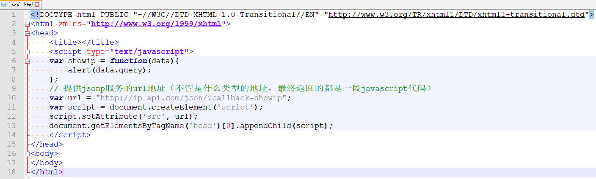
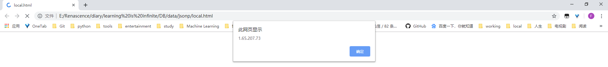

# IP Geolocation API^[1]^

免费用于非商业用途，无需API密钥，有使用限制，每分钟限制为150个IP地址请求，且为HTTP协议接口，要商业化应用（提供HTTPS协议接口），可以参阅专业的服务^[3]^

[TOC]

## 数据格式

### JSON

此API路径为：`http://ip-api.com/json/{query}`，*{query}*可以是一个IPv4/IPv6地址或者一个域名，如果没有提供则使用你的当前IP地址

<big><b>快速测试</b></big>

```python
>>> import requests
>>> requests.get('http://ip-api.com/json/24.48.0.1').json()
{'as': 'AS5769 Videotron Telecom Ltee',
 'city': 'Montreal',
 'country': 'Canada',
 'countryCode': 'CA',
 'isp': 'Le Groupe Videotron Ltee',
 'lat': 45.5808,
 'lon': -73.5825,
 'org': 'Videotron Ltee',
 'query': '24.48.0.1',
 'region': 'QC',
 'regionName': 'Quebec',
 'status': 'success',
 'timezone': 'America/Toronto',
 'zip': 'H1S'}
```

<big><b>参数</b></big>

你还可以在GET请求中附加以下参数，它们是可选的：

|   参数   |             描述              |
| :------: | :---------------------------: |
|  fields  |  response fields（响应字段）  |
|   lang   | response language（响应语言） |
| callback |  wrap inside (JSONP)（回调）  |

具体的使用说明见下

<big><b>返回的数据</b></big>

此API可以返回以下字段及值：

|    名称     |                             描述                             |        示例         |  类型  |
| :---------: | :----------------------------------------------------------: | :-----------------: | :----: |
|   status    |                     状态，success或fail                      |       success       | string |
|   message   | <small>错误信息，只在status为fail时存在，可以是以下值：private range、reserved range、invalid query</small> |    invalid query    | string |
|   country   |                            国家名                            |    United States    | string |
| countryCode |                     双字母国家代码^[2]^                      |         US          | string |
|   region    |                   地区/州短码（FIPS或ISO）                   |      CA or 10       | string |
| regionName  |                          地区/州名                           |     California      | string |
|    city     |                            城市名                            |    Mountain View    | string |
|     zip     |                           邮政编码                           |        94043        | string |
|     lat     |                       纬度（Latitude）                       |       37.4192       | float  |
|     lon     |                      经度（Longitude）                       |      -122.0574      | float  |
|  timezone   |                           城市时区                           | America/Los_Angeles | string |
|     isp     |                       互联网服务提供商                       |       Google        | string |
|     org     |                            组织名                            |       Google        | string |
|     as      |     as（Autonomous system自治系统）号和组织，以空格相隔      | AS15169 Google Inc. | string |
|    query    |                         用于查询的IP                         |    173.194.67.94    | string |

如果只需要它们中的一部分，请设置GET参数*fields*以指定应返回的字段，并用逗号分隔不同字段：

```
http://ip-api.com/json/24.48.0.1?fields=query,status,country,regionName,city,zip
```

*fields*还可以是数字，用于节省带宽（不明白）：

```
http://ip-api.com/json/24.48.0.1?fields=61439
```

<big><b>本地化</b></big>

可以通过将GET请求的*lang*参数设置为以下值之一来使响应内容中的city、regionName及country字段本地化：

| lang参数取值（ISO 639） |                 描述                  |
| :---------------------: | :-----------------------------------: |
|           en            |          English英语（默认）          |
|           de            |              Deutsch德语              |
|           es            |            Español西班牙语            |
|          pt-BR          | Español - Argentina（阿根廷）西班牙语 |
|           fr            |             Français法语              |
|           ja            |                日本語                 |
|          zh-CN          |                 中文                  |
|           ru            |              Русский俄语              |

<big><b>回调（JSONP）</b></big>

通过设置GET请求的*callback*参数使用回调函数，关于JSONP的使用参见[4]，或者见之于*./DB/data/jsonp*。假设我希望服务器能够告诉我明天的天气信息，譬如“晴天”、“阴天”、“雨天”等，于是服务器直接返回给我一个字符串信息，譬如“雨天”，但是我希望在返回给我的时候能组装成一句完整的话并主动弹出，如“您好，明天是雨天，祝您生活愉快”，很显然，不同的用户要求不一样，因此怎么处理返回的“雨天”应该由用户自行决定，我用一个函数封装它，一般称为回调函数，假设函数名叫`callback`：

```javascript
var callback = function(data){
	alert('您好，明天是'+data+'，祝您生活愉快');
};
```

在请求url中客户端需要告诉服务器端本地所用回调函数的名称，服务器将返回一个JS代码字符串，其为`callback("雨天");`，用户端执行该JS代码，即完成“回调”

获取ip地址：





2019/9/3 <a href="#IP Geolocation API^[1]^">回到顶部</a>

[1]: http://ip-api.com/	"API官网"
[2]: https://en.wikipedia.org/wiki/ISO_3166-1_alpha-2	"ISO_3166-1_alpha-2"
[3]: https://members.ip-api.com/	"ip-api"
[4]: http://ip-api.com/json/{query}?callback={callback}	"JSONP使用"

