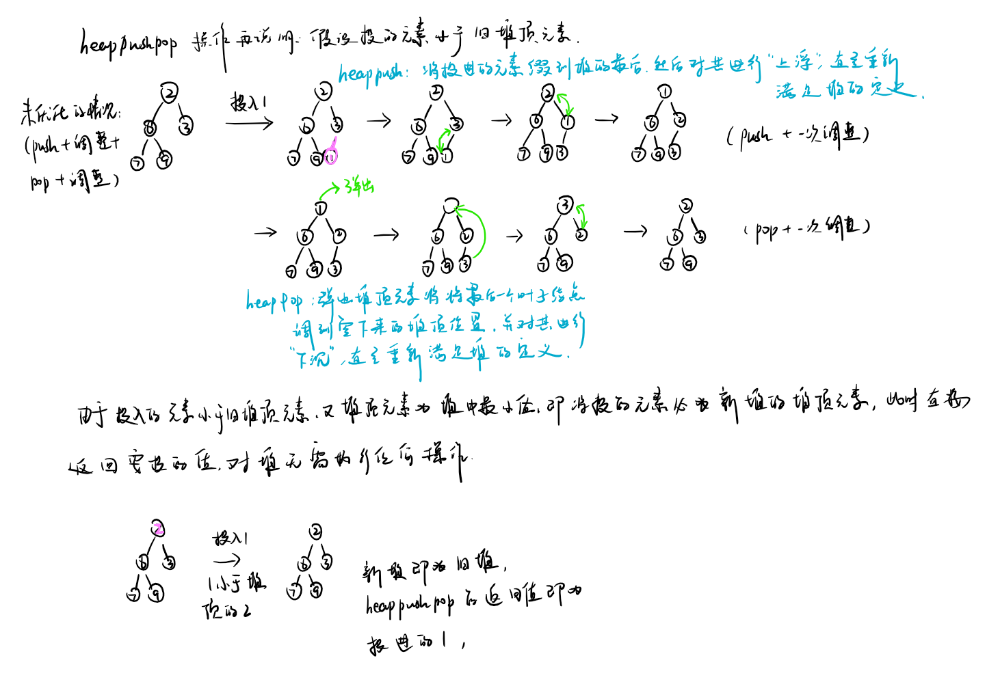

# heapq模块

这个模块提供了堆队列算法的实现，也称为优先级队列。特别地，此模块的堆数据结构是为一个“<font color='red'>小顶堆</font>”，即“弹出”的堆顶元素总是此堆中的最小元素，可以使用heap[0]来访问这个元素或者heappop方法弹出它。要创建一个“堆”，可以使用heapq.heapify()将一个普通列表转换为堆，或者直接使用<font color='blue'>[]</font>创建一个空堆，之后使用诸如heapq.heappush()向里面投放元素即可，这个空的列表将自动转变为一个堆。
<br/><br/>
<font color='green' size=3>基本操作</font>
<br/><br/>
<font size=5>heapq.heapify(list)</font>
<br/><br/>
&nbsp;&nbsp;&nbsp;&nbsp;在线性时间内将一个列表原址转换为一个堆（<font color='gray' size=2>堆的实现不需要复杂的数据结构，一般的一维数组即可，因为对于一个拥有n个节点的堆来说（就是一个完全二叉树），其中任意一个索引为i的节点，总是可以使用向下取整[i/2]得到其父节点的索引</font>）。
<br/><br/>
<font size=5>heapq.heappush(heap,item)</font>
<br/><br/>
&nbsp;&nbsp;&nbsp;&nbsp;将一个元素投放到堆中，并保持堆的不变性（<font color='gray' size=2>操作前后，堆始终为堆，即始终满足“堆”的定义，此为“不变性”：对于小顶堆来说，必须满足任意一个非叶子节点的元素值小于等于其左右子节点的元素值，即父节点总是小于或等于两个子节点，否则就不能称之为“（小顶）堆”。push操作首先将新元素缀到堆的最后即作为最后一个叶子节点，然后对这个“伪堆”进行调整（<font color='blue'>这里引入“伪堆”的概念，用以表示遭到破坏的堆的状态</font>），即对这个新的叶子节点进行多次的“上浮”操作，直到重新满足堆的定义为止</font>）。
<br/><br/>
<font size=5>heapq.heappop(heap,item)</font>
<br/><br/>
&nbsp;&nbsp;&nbsp;&nbsp;弹出堆中的最小元素（<font color='gray' size=2>堆顶元素</font>），并保持堆的不变性（<font color='gray' size=2>弹出堆顶元素之后堆顶并非留空，而是会将最后一个叶子节点调换到堆顶位置，但此时势必会破坏“堆”的结构，因为对于堆这个二叉树的层级结构来说，小顶堆的上层元素总是小于等于下层元素，因此调换位置后，下层元素跑到了上层，于是不再满足堆的定义，这时将会对这个新的堆顶节点进行多次的“下沉”操作，直到重新满足堆的定义为止</font>）。如果对一个空堆进行pop，那么将会引发IndexError异常。和heap[0]的区别：heap[0]访问但是不弹出堆顶元素，堆本身不发生任何改变。heap[0]访问空堆同样会导致IndexError。heappop获取最小值操作的时间复杂度仅为O(log N)，其中N是堆大小。
<br/><br/>
<font color='green' size=3>组合操作</font>
<br/><br/>
<font size=5>heapq.heappushpop(heap,item)</font>
<br/><br/>
&nbsp;&nbsp;&nbsp;&nbsp;向旧堆中投放一个元素然后再弹出新堆的堆顶元素，并保持堆的不变性，相当于heappush()和heappop()的组合操作，但是前者比后者更加高效（<font color='gray' size=2>虽然我不知道具体的优化过程，但说一下我的想法：按照组合操作的两个基本步骤（见上），首先push一个元素之后要进行一次伪堆调整，pop堆顶元素之后还得进行一次伪堆调整，前后共两次，但假如push的元素大于等于堆顶元素，那么我们并不需要进行调整就知道，我们将要pop的元素必然就是旧堆的堆顶元素，因此我们直接弹出这个堆顶元素然后将要push的元素直接放到空下来的堆顶位置，并进行一次调整即可；若push的元素小于堆顶元素，那么立即可知，最后弹出的新堆的堆顶元素就是push值，而新堆和旧堆将保持一模一样，因此这种情况下，不需要进行任何对伪堆的调整，时间开销为0。</font>）。
<br/><br/>
<font size=5>heapq.heapreplace(heap,item)</font>
<br/><br/>
&nbsp;&nbsp;&nbsp;&nbsp;弹出旧堆顶元素并将新元素直接放到原堆顶位置（<font color='gray' size=2>此时还是一个“伪堆”</font>），并进行调整使其重新构成一个堆（<font color='gray' size=2>不变性</font>）。如果旧堆为空，则将引发IndexError异常。此操作相当于heappop()和heappush()的组合，但比之高效（<font color='gray' size=2>很显然，先进行pop需要一次调整，再push又需要一次调整，前后两次，但是heapreplace只需要一次调整，pop之后直接将新元素push至空下来的堆顶位置，一次性调整完毕</font>）。
<br/><br/>
<font color='green' size=3>基于堆的三个通用操作</font>
<br/><br/>
<font size=5>heapq.merge(*iterables,key=None,reverse=False)</font>
<br/><br/>
&nbsp;&nbsp;&nbsp;&nbsp;iterables是可变参数，传递多个可迭代对象（<font color='gray' size=2>必须是已排序序列，heapq.merge并不检查参数序列是否已经排序，因此当没有排序的时候，合并的结果必然是不符合预期的。合并过程（以指针描述）：设有m个序列，给每一个序列添加一个指针，初始时刻指针都指向序列的首个元素，比较m个指针所指向元素的大小，假设输出最小的那一个，元素输出之后指针后移一位（那些指向较大值的指针位置保持不变），然后再比较m个指针所指向的元素，重复上述过程，直至只剩下一个序列的时候，一次性全部输出，无需再比较了</font>），key和reverse是命名关键字参数，必须以键值对形式进行参数传递，key指定一个键函数，用于从序列的每一个元素中提取比较键，譬如序列元素为元组类型(name,num)，那么我们可以指定num编号作为不同元组大小比较的关键字。
<br/><br/>
<font size=5>heapq.nlargest(n,iterable,key=None)</font>
<br/><br/>
&nbsp;&nbsp;&nbsp;&nbsp;从序列中返回前n个最大的元素，key用于指定比较键。
<br/><br/>
<font size=5>heapq.nsmallest(n,iterable,key=None)</font>
<br/><br/>
&nbsp;&nbsp;&nbsp;&nbsp;从序列中返回前n个最小的元素，key用于指定比较键。
<br/><br/>


```python
import heapq
```


```python
heap=[3,6,1,7,2]
heapq.heapify(heap)
print(heap)
```

> 输出：<br>[1, 2, 3, 7, 6]


```python
m=heapq.heapreplace(heap,9)
print(m,heap)
```

> 输出：<br>1 [2, 6, 3, 7, 9]


```python
m=heapq.heappushpop(heap,4)
print(m,heap)
```

> 输出：<br>2 [3, 6, 4, 7, 9]





```python
m=heapq.heappushpop(heap,1) # 执行操作前的堆heap为：[3, 6, 4, 7, 9]
print(m,heap)
```

> 输出：<br>1 [3, 6, 4, 7, 9]

```python
m1=[5,3,1,7,9]
heapq.heapify(m1)
for i in range(8):
    try:
        print(heapq.heappop(m1),end=',')
    except:
        print('空堆',end=',')
```

> 输出：<br>1,3,5,7,9,空堆,空堆,空堆,


```python
ret=heapq.merge([1, 3, 5, 7, 9],[2, 6, 4, 10, 8],key=None)
for i in ret:
    print(i,end=',')
```

> 输出：<br>1,2,3,5,6,4,7,9,10,8,


```python
# 找出下列价格最小和最大的前三个品牌电脑名
PCinfo = [
{'name': 'IBM', 'price': 91.1},
{'name': 'Lenovo', 'price': 543.22},
{'name': 'Acer', 'price': 21.09},
{'name': 'Thinkpad', 'price': 31.75},
{'name': 'Hasee', 'price': 16.35},
{'name': 'Samsung', 'price': 115.65}
]
print('最低价：',[i['name'] for i in heapq.nsmallest(3,PCinfo,key=lambda e:e['price'])])
print('最高价：',[i['name'] for i in heapq.nlargest(3,PCinfo,key=lambda e:e['price'])])
```

> 输出：<br>最低价： ['Hasee', 'Acer', 'Thinkpad']<br>
> 最高价： ['Lenovo', 'Samsung', 'IBM']

```python
# 如果堆元素不是简单的整型数字，而是对象obj，可以吗？答：可以
# 那么元素必须是以(priority,obj)但不仅限于此结构的序列形式投放到堆中，其中priority含义是优先级，它是一个可以进行"<"小于比较操作的运算对象，
# 数字即可，须知，优先级priority在序列结构中的位置必须是“首次比较而不等”的位置上
# 譬如([1,obj])和(1,obj)的是不能投放到同一堆中的，因为两个元组中的首个不等元素[1,obj]和无法通过"<"进行比较，因此我们才规定：数字的priority
# 必须在“首次比较而不等”的位置上，但(priority,obj)存在一个缺陷，就是当priority相同的情况下，将对obj进行比较，可想而知，一定会出错
# 因此我们改而使用(priority,index,obj)来实现优先级队列，其中index是一个唯一的不断递增的编号，用以当优先级
# 相同的情况下，通过比较index得到堆顶元素
heap=[]
heapq.heappush(heap,(3,{'name':'daiyang'}))
heapq.heappush(heap,(1.8,[2,{'name':'muggle'}]))
heapq.heappush(heap,(1,7,{'name':'daixiaodong'}))
heapq.heappush(heap,(1.5,{'name':'guqifei'}))
print(heap)
```

> 输出：<br>[(1, 7, {'name': 'daixiaodong'}), (1.5, {'name': 'guqifei'}), (1.8, [2, {'name': 'muggle'}]), (3, {'name': 'daiyang'})]

```python
# 实现优先级队列（来自《Python CookBook》）
class TaskQueue:
    
    def __init__(self):
        self.__queue=[] # 初始化一个“空堆”
        self.__index=0 # 当优先级设置相同时，则使其按照先投进先弹出的顺序弹出
        
    def push(self,task,priority):
        self.__index+=1
        heapq.heappush(self.__queue,(-priority,self.__index,task)) # heapq是小堆顶，所以要对priority取反，使得最高优先级（正整数）能够成为堆顶元素
        
    def pop(self):
        try:
            print(heapq.heappop(self.__queue)[-1])
        except:
            print('暂无任务')
    
tasker=TaskQueue()
tasker.push('Have dinner',4)
tasker.push('Go to YanCheng',2)
tasker.push('Study',10)
tasker.push('meet my friend',4)

tasker.pop()
tasker.pop()
tasker.pop()
tasker.pop()
tasker.pop()
# 因为我们不可能记住所有事情的权重，导致很可能给错权重值，假设事情的紧迫程度依据截止时间，那么我们只要传递截止时间即可，在内部根据该时间计算时间的具体权重
```

> 输出：<br>Study<br>
> Have dinner<br>
> meet my friend<br>
> Go to YanCheng<br>
> 暂无任务


muggledy 2018/12/24~2018/12/25
